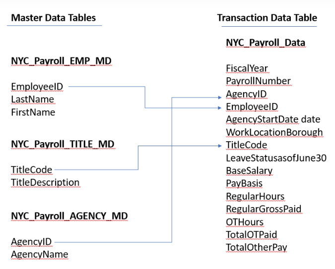
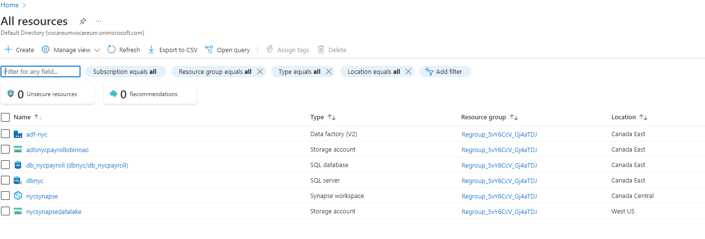
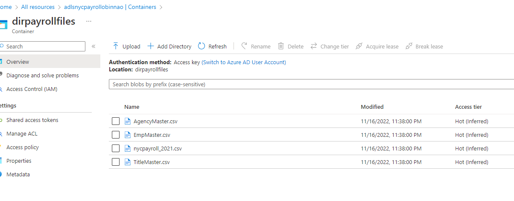
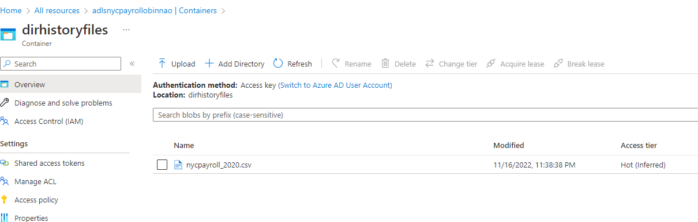
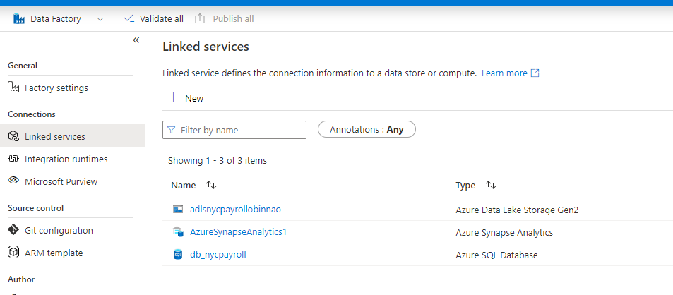
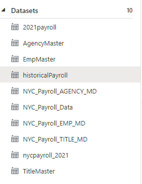
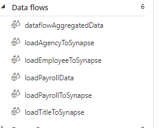

# Data Integration Pipelines for NYC Payroll Data Analytics

The City of New York would like to develop a Data Analytics platform on Azure Synapse Analytics to accomplish two primary objectives:

1. Analyze how the City's financial resources are allocated and how much of the City's budget is being devoted to overtime.
2. Make the data available to the interested public to show how the City’s budget is being spent on salary and overtime pay for all municipal employees.

This project will involve creating high-quality data pipelines that are dynamic, can be automated, and monitored for efficient operation. The project will aim to develop pipelines that maintain overall data quality.

The source data resides in Azure Data Lake and needs to be processed in a NYC data warehouse in Azure Synapse Analytics. The source datasets consist of CSV files with Employee master data and monthly payroll data entered by various City agencies.

## Summary of Process

1. Infrastructure was setup: Azure Datalake Gen2, Azure Data Factory, Azure SQL Database and Azure Synapse with a dedicated SQL Server pool.

2. Data was ingested into Azure Datalake Gen2

3. Linked services were created in Azure Data Factory to the data sources and destinations

4. Tables were created in Azure SQL database and Azure synapse. Sql scripts are stored in the `sql_scripts` folder

5. Data sets were created in Azure Data Factory

6. Data flows were set up in Azure Data Factory

7